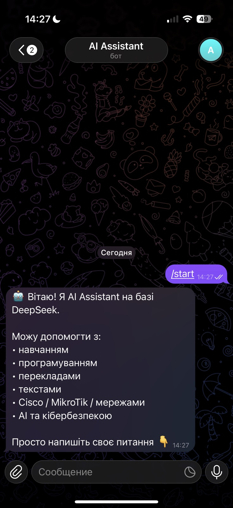
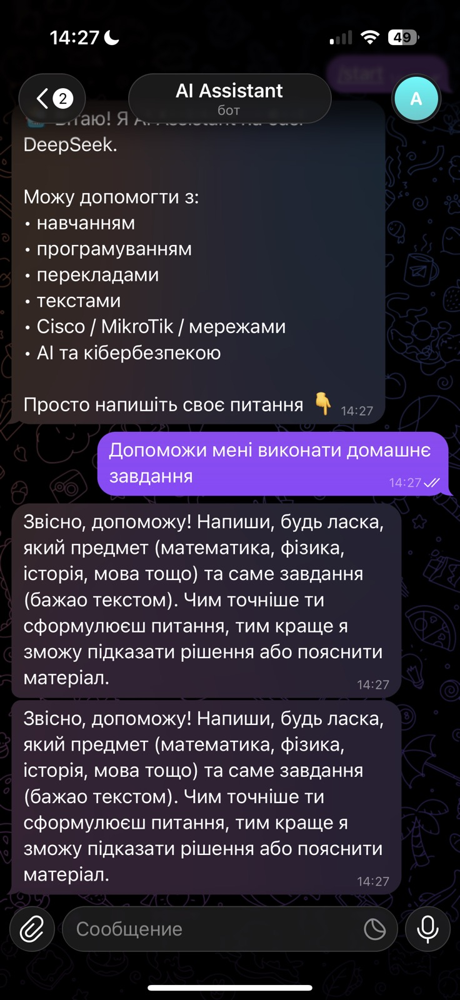
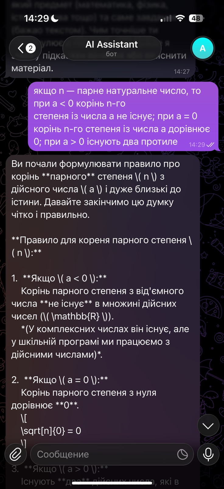

# DeepSeek Telegram Bot 🤖

AI Telegram bot powered by DeepSeek API and aiogram.

## Features

- AI chat assistant
- Context memory
- Telegram integration
- Error handling
- Ukrainian language support
- Cisco / MikroTik / networking help

## Screenshot





## Technologies

- Python
- aiogram
- DeepSeek API
- OpenAI SDK
- dotenv

## Installation

```bash
pip install -r requirements.txt
```

## Run

```bash
python bot.py
```

## Environment Variables

Create `.env` file:

```env
TELEGRAM_BOT_TOKEN=your_token
DEEPSEEK_API_KEY=your_key
```

## Author

Oleksandr Safarov